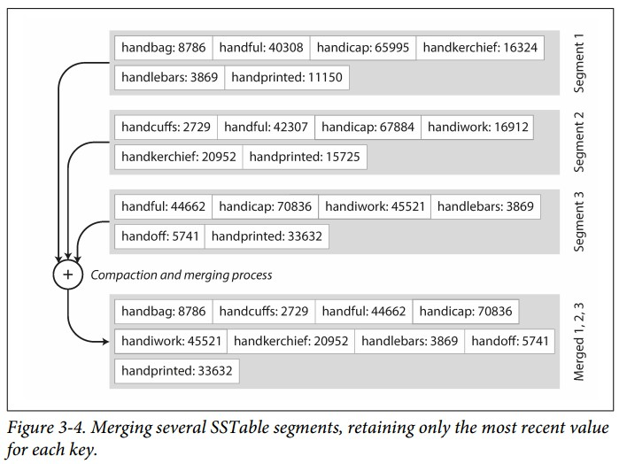
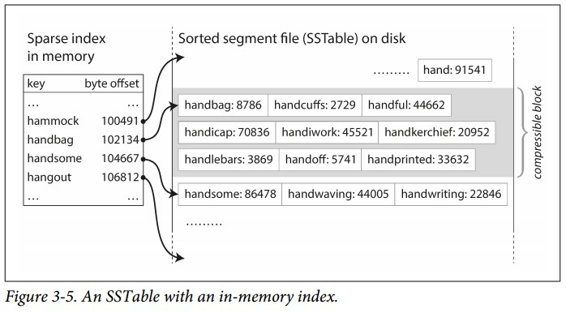

## Hash索引
hash索引的整体思路是基于log的，写入数据时追加到log文件尾部，由于是顺序写，从而保证了效率
### 一.初级hash索引

整体结构分为两个部分：索引和数据

**索引** :
- hash结构，存放在内存中，hash value为真实数据在log文件中的偏移

**数据** :
- 存放在磁盘文件上(log文件)，包含key对应的真实数据

读取时**根据数据偏移找到对应的value**；写入时直**接将新的数据append到log文件的尾部同时更新内存中的索引**。Bitcask的存储引擎采用了类似的思路

为了避免log文件越来越大(写入是不断append)，最后耗尽磁盘，**将大的log文件切分成固定大小的segment文件。在写入时，append到当前segment文件尾部，当segment文件增大到一定的大小时，关闭当前segment文件，同时创建一个新的segment文件，之后的写入append到新的segment文件尾部**。然后在这些segment文件上执行**compaction**操作，删除重复过时的，只保留最近最新的数据。下图展示了一个segment文件执行compaction操作，生成一个新的Compacted Segment文件

在执行compaction的时候，可以同时对多个segment文件进行操作，并进行融合(merge)，生成一个结果文件

**注意：** segment文件在写入之后是不会改变的，进行compaction并融合之后的结果会生成一个新文件，因此可以使用另外的线程在后台执行compaction，这不会影响在旧的segment文件上进行读写操作。当融合流程完成之后，读操作将切换到融合后的新文件，旧的segment文件就可以删掉了。

当存在多个segment文件时，每一个segment文件在内存中都有自己的hash索引，查找时，先在最新的segment文件中查找，如果没有找到，就去查找次新的segment文件，以此类推。因此上面的融合流程会减少segment文件数量，从而保证不用查找太多的hash索引

在实现上述流程时，有许多**重要的问题**需要考虑：
- 文件格式 ： 实现上通常使用二进制的格式，而不是这里展示的csv格式
- 删除记录 ： 如果我们要删除一行记录，通常需要append一个删除动作，在融合的时候，删除动作会告诉融合流程删掉对应的数据。
- 崩溃恢复 ： 如果数据库重启，会丢失内存中所有的索引结构，虽然可以通过所有的segment文件重建索引，但是当segment文件很大时，这个操作可能太耗时，Bitcask在磁盘上保存了每个segment文件的hash索引快照，从而加快了恢复过程
- 记录部分写 (Partially written records) : 当数据库在写入操作执行过程中崩溃，会导致部分写。Bitcask的文件包含了校验和，会发现这些坏掉的数据
- 并发控制 ：由于写入操作严格按照顺序写入，常见的方式是使用一个写线程。数据segment文件只能追加或者不变，因此可以多个读线程并发读

追加写log的方式看起来有些浪费，为什么不在原有的基础上直接覆盖了？
- 追加写和融合文件的方式比起随机写更加高效
- 并发控制和崩溃恢复更加简单，因为segment文件只会追加或者不变
- 融合旧的segment文件防止数据随着时间过分分散

上述hash索引的缺点：
- hash索引必须全部存放在内存中，如果key的数量太大，内存不够
- hash索引无法支持范围查找，比如查找kitty0000 到 kitty9999 之间的所有数据

### 二. SSTables和LSM-Trees
上面的方案中segment文件由key-value序列组成，没有顺序，在SSTables(Sorted String Table)中，key-value序列根据key排序，相比起之前的方案，优势在于：  
1. 融合segment的过程简单高效，即使segment文件比可用内存大。整个过程就像使用 mergesort算法(归并排序)，在排序过程中，当多个segment包含相同的key时，保留最近时间的，丢掉旧的数据

  
2. 在查找某个key时，**不再需要在内存中保留所有的key对应的偏移**
  
假设要查找handiwork，虽然索引中没有handiwork对应的value，但有handbag和handsome的数据的偏移，并且我们知道**handiwork的顺序在handbag和handsome之间。因此只需要跳到handbag的偏移然后不停向后查找，直到找到handiwork(或者不存在找不到)**。这种方式节省了索引占用的内存

3. 由于read操作需要扫描请求范围内多个key-value对，所以可以将这些记录分组到一个block中，压缩写磁盘，内存中的索引记录的不再是某一个key的数据偏移，而是每一个block的开始位置

#### 构建和维护SSTables
存储引擎工作流程如下：
- 当有写入操作时，将数据写入到内存中的平衡树结构中，这种内存中的树叫做 **memtable**
- 当 memetable 的大小超过一定阈值，将它作为SSTable文件写入到磁盘上。由于memtable中的key-value数据是有序的，因此写入过程高效。新的SSTable文件成为了数据库最新的segment。在SSTable写入磁盘的过程中，创建一个新的memtable
- 查找数据时，先查找当前的memtable，然后查找磁盘上最近的segment，以此类推
- 随着时间的推移，后台线程执行merge和compaction操作合并segment文件
- 当database崩溃时，会丢失最近的写入数据(它们保存在内存中的memtable中)。为了防止这种情况，在磁盘上使用另外的一个log文件，每次的写操作记录先append到这个log文件中。这个文件只是用于崩溃后恢复memtalbe，每次memtable写为SSTable时，可以删除它

#### Making an LSM-tree out of SSTables
这里讨论的算法对于LevelDB和RockesDB是关键的。基于对有序文件进行merge和compaction的存储引擎称为LSM存储引擎  
Lucene (被用在Elasticsearch 和 Solr) 使用相似的方式来存储词典(term dictionary)

#### 性能优化
LSM-tree算法在查找一个不存在的key时会很慢，因为你必须先查找memtable，然后再查找所有的segment文件(从磁盘上读取)。为了加快查询过程，存储引擎经常使用 **Bloom filter** (布隆过滤器:有不一定有，无一定无)  
有多种方式决定对SSTable进行compaction和merge操作的时机和顺序，最常见的方式是 size-tiered 和 leveled compaction (大小分层，分层compaction)。LevelDB和RocksDB使用分层compaction，HBase使用size-tiered，Cassandra这两种方式都支持。在size-tiered compaction中，新的更小的SSTables逐步合并到旧的更大的SSTable中；而在leveled compaction中，key的范围划分到更小的SSTable中，旧的数据移动到分开的level中，这样就可以使compaction工作增量进行并减少需要的磁盘空间