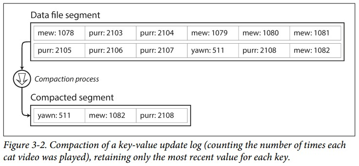

## Hash索引
hash索引的整体思路是基于log的，写入数据时追加到log文件尾部，由于是顺序写，从而保证了效率
### 一.最初级hash索引

整体结构分为两个部分：索引和数据

**索引** :
- hash结构，存放在内存中，hash value为真实数据在log文件中的偏移

**数据** :
- 存放在磁盘文件上(log文件)，包含key对应的真实数据

读取时**根据数据偏移找到对应的value**；写入时直**接将新的数据append到log文件的尾部同时更新内存中的索引**。Bitcask的存储引擎采用了类似的思路

为了避免log文件越来越大(写入是不断append)，最后耗尽磁盘，**将大的log文件切分成固定大小的segment文件。在写入时，append到当前segment文件尾部，当segment文件增大到一定的大小时，关闭当前segment文件，同时创建一个新的segment文件，之后的写入append到新的segment文件尾部**。然后在这些segment文件上执行**compaction**操作，删除重复过时的，只保留最近最新的数据。下图展示了一个segment文件执行compaction操作，生成一个新的Compacted Segment文件

在执行compaction的时候，可以同时对多个segment文件进行操作，并进行融合(merge)，生成一个结果文件

**注意：** segment文件在写入之后是不会改变的，进行compaction并融合之后的结果会生成一个新文件，因此可以使用另外的线程在后台执行compaction，这不会影响在旧的segment文件上进行读写操作。当融合流程完成之后，读操作将切换到融合后的新文件，旧的segment文件就可以删掉了。

当存在多个segment文件时，每一个segment文件在内存中都有自己的hash索引，查找时，先在最新的segment文件中查找，如果没有找到，就去查找次新的segment文件，以此类推。因此上面的融合流程会减少segment文件数量，从而保证不用查找太多的hash索引

