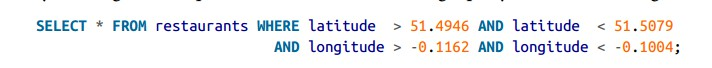

### 其他类型索引
**辅助索引**  
在索引中，key对应的value既可以是记录本身，也可以是记录存储的位置。在后面这种情况下，存储记录的地方叫 heap file，这种方式比较普遍，因为当有多个辅助索引时，每个辅助索引只是指向heap file中记录的位置，从而避免了数据冗余。  
当更新记录时，会存在两种情况：  
1. 原空间足够，直接更新记录
2. 原空间不够(新记录更大)，在heap file中新开辟一片更大的空间存储。这时，所有的辅助索引都要更新指向新的位置，或者将一个指向新位置的指针放在原来的地方。

在某些情况下，读请求会因为上面这种索引间的跳跃损失性能，所以需要将记录直接保存在索引中，这就是**聚集索引**。在MySQL的InnoDB引擎中，主键是聚集索引，辅助索引则指向主键(而不是 heap file 上的位置)
```
因为InnoDB的数据文件本身要按主键聚集，所以InnoDB要求表必须有主键（MyISAM可以没有），如果没有显式指定，则MySQL系统会自动选择一个可以 唯一 标识数据记录的列作为主键，如果不存在这种列，则MySQL自动为InnoDB表生成一个隐含字段作为主键，这个字段长度为6个字节，类型为长整形。

```
聚集索引和非聚集索引的一个折中叫做 covering index 或者 index with included columns 。 这使得某些查询只需要查找索引就能完成。

#### 多列索引
多列索引：最左匹配原则  
多列索引经常用来一次查询多个列，例如：  

  

标准的B数和LSM-tree无法有效的满足这种查询，要不查找特定范围的latitude，要么查找特定范围的longitude，无法两者兼顾。
这种查询需要使用R-trees索引， 例如PostGIS实现的空间索引

#### 全文搜索和模糊索引
有时候，我们需要查找query的相似项，比如拼写错误的单词，这就需要进行模糊查询  
**Lucene 支持在文本中查找与指定的单词满足一定编辑距离的相似词**