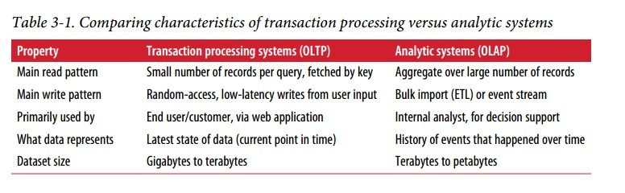
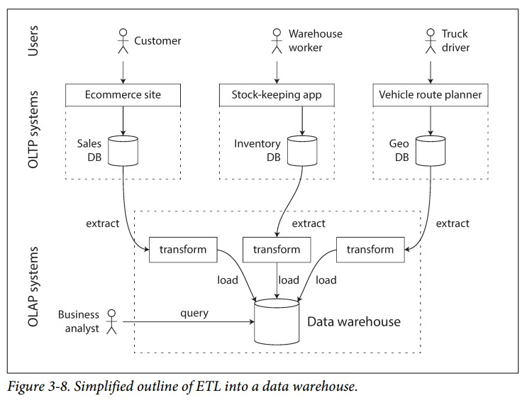
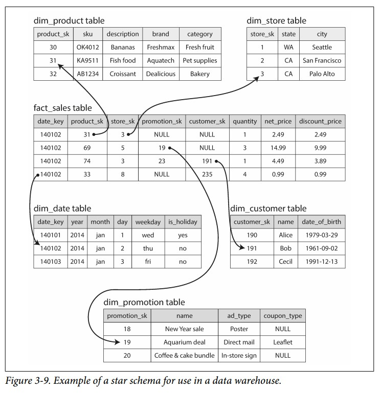

### OLTP or OLAP
OLTP : online transaction processing 在线业务处理   
OLAP : online analytic processing 在线数据分析 

OLAP和OLTP对比
    

最初，大家都是用相同的数据库来完成OLAP和OLTP的任务，后来出现了专门的数据分析数据库，叫**数据仓库**

#### 数据仓库
数据仓库中的数据通常来源于OLTP数据库，获取数据灌入数据仓库的过程叫 **ETL** (Extract-Transform-Load)  

  

数据仓库为了满足数据分析的需要，设计了专门的优化算法来提高性能

#### 星型和雪花型架构
在数据仓库中，数据表分为两种：fact table 和 dimension table (fact table 中存放数据记录，例如用户的购买记录， dimension table 中存放特征维度，比如商品的种类)  

 

上图中间的fact_sales_table就是 fact table，它的一些字段指向了 dimension table 中的一行  
数据仓库的架构分为两种：星型和雪花型，两者的区别在于：
- 雪花型中 dimension table 还可以包含 子dimension table，它的结构更加复杂
