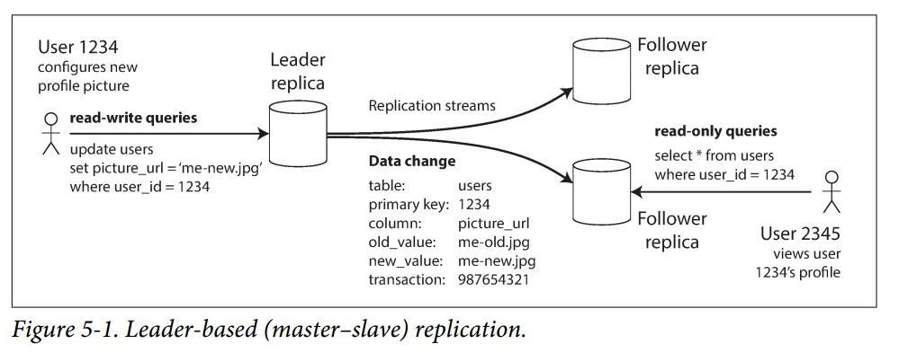
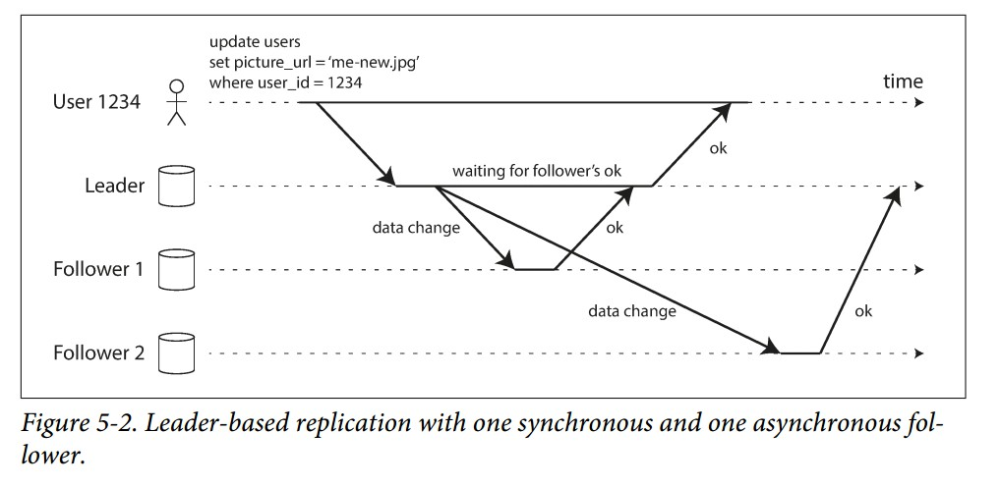

## 主从结构
每一个节点上都包含全量的数据，写操作需要在所有的节点上都执行一遍，从而保证数据的一致性，最常用的方法是**主从结构**:
1. 一个数据副本被定义为主节点，如果客户端想要写数据，必须将写操作发送给主节点，主节点首先将数据写到自己的存储上。
2. 其他的节点就是从节点。当主节点写入新的数据时，它会将数据更改以replication log 或者 change stream 的方式发送给从节点，每一个从节点按照**主节点写入数据的顺序写入新的数据**。
3. 当客户端想要**读取数据时，它可以请求主节点或者从节点，但是对于写请求来说，只能由主节点处理**。

很多关系型数据库都支持这种模型，比如PostgreSQL, MySQL, Oracle Data Guard 和 SQL Server ， 它同样用在了一些非关系型数据库，比如 MongoDB, RethinkDB 和 Espresso 。最后，不仅是数据库系统使用主从结构，分布式消息队列比如Kafka和RabbitMQ都使用它

### 同步复制 VS 异步复制
多副本系统中很重要的一个细节就是 **数据是同步更新还是异步更新**

在5-2中，主节点等待Follower1更新完成才发送回复(同步)，不等待Follower2的回应(异步)。  
同步的优点：从节点数据总是最新的，如果主节点挂了，从节点上仍有最新的数据。  
同步的缺点：如果没有收到从节点的回应(从节点挂了 or 网络问题 or 其他)，主节点会阻塞所有的写操作等待。  
**在实践中，是不会让全部从节点都处于同步状态，当我们打开数据库同步更新，它通常意味着一个从节点是同步的，其他从节点仍然是异步的**。如果同步从节点不可用了，会有一个异步从节点变为同步状态，从而保证整个系统中至少有两个节点有最新的数据。这种称为**半同步**  
通常，如果一个主从结构被设置为完全异步的，当主节点失败并且无法恢复，任何还没有被从节点复制的写操作都会丢失，即使主节点给客户端返回了确认也不代表写操作是可靠的。它的一个优点在于即使所有的从节点都挂了也不影响主节点继续处理。  
虽然完全异步的可靠性很弱，但仍得到了广泛的应用，特别是在从节点很多或者地理分散的情况下，我们将在 "Problems with Replication Lag" 中继续讨论这个问题。  

### 副本的一些研究
在异步结构中如果主节点挂了会导致丢失数据，因此研究者提出了一些防止丢失数据并且提供高性能的方法，例如 chain replication 是一个同步复制的变种，被用在了 Microsoft Azure Storage  
在副本 一致性(consistency) 和 共识(多个节点对数据达成一致) 之间有很强的关联性，这些细节将会在第9章讨论。

### 设置新的从节点
