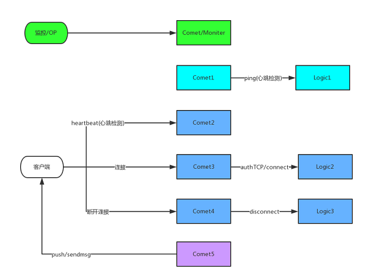

## Comet简介
comet是goim的第一层，它介于客户端和Logic服务之间，使用Bucket管理客户端与服务端的连接，逻辑上将客户端划分为不同的subkey和room，在后端向客户端推送消息时，可以根据subkey和room对不同的客户端进行推送。

## Comet结构图
    

图中的comet(1/2/3/4/5)和Logic(1/2/3)只是为了方便说明各种功能，并不代表这些功能都分布在不同的服务节点上。  
comet整体分为3个部分:
1. moniter : 对外提供诊断接口，功能比较简单，用于检查当前是否存在一个可用的logic服务节点。
2. 探测logic服务：为了实时的掌握Logic服务的状态，comet启动专门的goroutine来执行探测操作，对于配置中的每一个logic服务地址都启动一个goroutine在循环中每隔一段时间就调用其ping接口，探测服务是否可用，comet中维护者所有的logic服务地址和状态。moniter中的诊断服务就是基于探测服务。
3. 管理客户端连接：接受客户端的连接，维护与客户端的心跳，转发Push服务发送给客户端的数据。

## 探测Logic服务
[详细见comet-Clients连接池](comet-Clients连接池.md)

## 客户端连接管理(以tcp.go为例)
### 新建连接

当新的客户端连接到来时，很重要的工作是对客户端进行认证，并分配对应的subkey和room，调用Logic服务的Connect接口实现。

```
// auth for goim handshake with client, use rsa & aes.
func (server *Server) authTCP(rr *bufio.Reader, wr *bufio.Writer, p *proto.Proto) (key string, rid int32, heartbeat time.Duration, err error) {
	......

	if key, rid, heartbeat, err = server.operator.Connect(p); 
        ......

	return
}

func (operator *DefaultOperator) Connect(p *proto.Proto) (key string, rid int32, heartbeat time.Duration, err error) {
	key, rid, heartbeat, err = connect(p)
	return
}

func connect(p *proto.Proto) (key string, rid int32, heartbeat time.Duration, err error) {
	var (
		arg   = proto.ConnArg{Token: string(p.Body), Server: Conf.ServerId}
		reply = proto.ConnReply{}
	)
	if err = logicRpcClient.Call(logicServiceConnect, &arg, &reply); err != nil {
		log.Error("c.Call(\"%s\", \"%v\", &ret) error(%v)", logicServiceConnect, arg, err)
		return
	}
	key = reply.Key
	rid = reply.RoomId
	heartbeat = 5 * 60 * time.Second
	return
}

```
Logic服务的Connect接口需要两个参数：
1. Token : 根据数据包Body生成。
2. ServerId : comet节点id(comet服务配置中获得)

Connect接口返回两个参数:
1. key : 主题id，支持多个客户端关注相同的主题。
2. RoomId : 房间号

客户端连接依照上面两个维度进行划分。

### 客户端心跳检测
[详细见comet-tcp服务(serveTCP,dispatchTCP函数)](comet-tcp服务.md)

### 转发Push服务数据
在启动comet时，调用InitRPCPush函数启动RPC服务，提供接口用于接收Push服务的消息。  [详细见RPCPush](comet-RPCPush.md)  
rpc.go中提供了提供了多种Push消息的方式，dispatchTCP中执行连接处理的goroutine会在Channel收到消息后直接转发给客户端。
```
// main.go
// start rpc
if err := InitRPCPush(Conf.RPCPushAddrs); err != nil {
	panic(err)
}

// rpc.go
func (this *PushRPC) PushMsg(arg *proto.PushMsgArg, reply *proto.NoReply) (err error) {
	var (
		bucket  *Bucket
		channel *Channel
	)
	if arg == nil {
		err = ErrPushMsgArg
		return
	}
	bucket = DefaultServer.Bucket(arg.Key)
	if channel = bucket.Channel(arg.Key); channel != nil {
		err = channel.Push(&arg.P)
	}
	return
}

// tcp.go dispatchTCP.go
	for {
		...
		var p = ch.Ready()
		...
		switch p {
		case proto.ProtoFinish:
			finish = true
			goto failed
		case proto.ProtoReady:
			// fetch message from svrbox(client send)
			for {
				if p, err = ch.CliProto.Get(); err != nil {
					err = nil // must be empty error
					break
				}
				if err = p.WriteTCP(wr); err != nil {
					goto failed
				}
				p.Body = nil // avoid memory leak
				ch.CliProto.GetAdv()
			}
		default:
			// server send
			if err = p.WriteTCP(wr); err != nil {
				goto failed
			}
		}
		// only hungry flush response
		if err = wr.Flush(); err != nil {
			break
		}
	}
```

