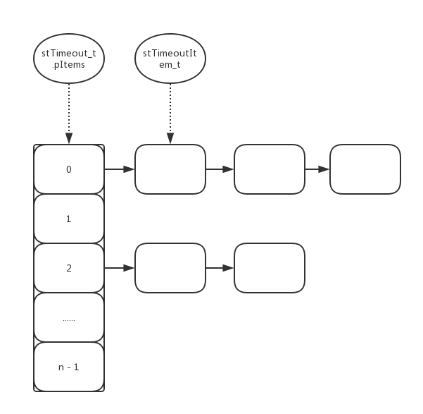

## 定时器管理
libco采用列表对定时器进行管理，如下图所示:


stTimeout_t 结构中的 pItems 是一个 stTimeoutItemLink_t 列表，列表中的每一项是一个由 stTimeoutItem_t 构成的双向链表。

### 数据结构

```
struct stCoEpoll_t
{
	int iEpollFd;                                   // epoll fd
	static const int _EPOLL_SIZE = 1024 * 10;

	struct stTimeout_t *pTimeout;                   // 超时管理结构体

	struct stTimeoutItemLink_t *pstTimeoutList;

	struct stTimeoutItemLink_t *pstActiveList;

	co_epoll_res *result; 

};

typedef void (*OnPreparePfn_t)( stTimeoutItem_t *,struct epoll_event &ev, stTimeoutItemLink_t *active );
typedef void (*OnProcessPfn_t)( stTimeoutItem_t *);

struct stTimeoutItem_t
{

	enum
	{
		eMaxTimeout = 40 * 1000         //40s
	};
	stTimeoutItem_t *pPrev;				 
	stTimeoutItem_t *pNext;				
	stTimeoutItemLink_t *pLink;         // 指向Item对应的链表

	unsigned long long ullExpireTime;   // 超时时间

	OnPreparePfn_t pfnPrepare;
	OnProcessPfn_t pfnProcess;

	void *pArg;                         // routine
	bool bTimeout;
};

// 侵入式双向链表
struct stTimeoutItemLink_t
{
	stTimeoutItem_t *head;	
	stTimeoutItem_t *tail;

};

// 超时管理结构体
struct stTimeout_t
{
	stTimeoutItemLink_t *pItems;        // ItemLink列表
	int iItemSize;                      // ItemLink列表中ItemLink的数量

	unsigned long long ullStart;
	long long llStartIdx;
};
```
