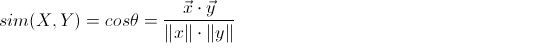
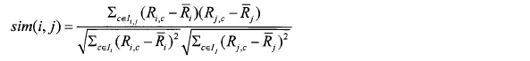
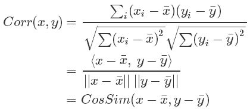

## 相似度计算方式
### 1. 欧式距离: 
适用于度量绝对差异，不适用于高维向量比较
### 2. 余弦相似度: 
适用于高维向量，度量两个向量的方向，与向量长度无关，但对绝对值大小不敏感。

### 3. 调整的余弦相似度: 
向量减去各个维度上的均值，再计算余弦相似度

利用调整的余弦相似度就按上面的例子，计算得到的相似度为-0.1，符合直觉

### 4. 皮尔逊相关度:
两个向量首先减去向量的均值，然后计算余弦相似度

皮尔逊相关度度量两个变量的变化趋势是否一致。

**调整的余弦相似度与皮尔逊相关度之间的差异在于：调整的余弦相似度对列向量中性化，皮尔逊相关度对行向量中心化**

### 5. 杰卡德相似度:
计算两个集合的交集元素个数在并集中所占的比例，适用于布尔向量表示。