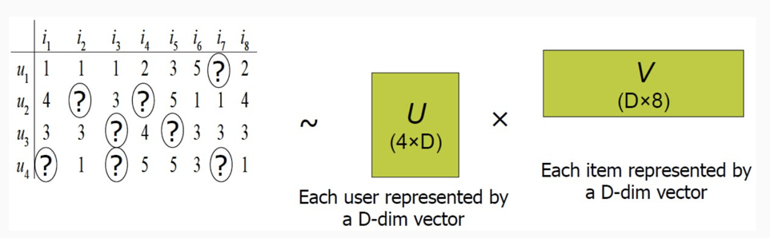
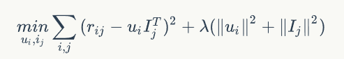
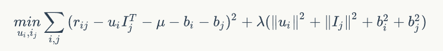
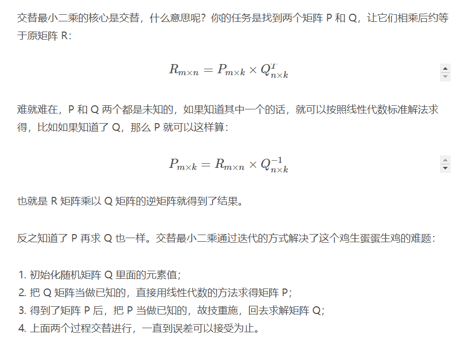
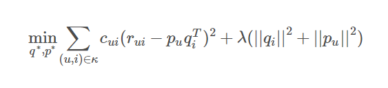
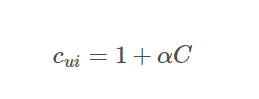

### 回顾矩阵分解

矩阵分解将用户评分矩阵分解为用户矩阵和物品矩阵

损失函数(是否加入偏置项):

优化算法
1. SGD
2. ALS (交替最小二乘)

### ALS (交替最小二乘)

### 隐式反馈
用户没有明确反馈对商品的偏好，也就是没有直接打分，我们只能通过用户的某些行为来推断他对商品的偏好。比如，在电视节目推荐的问题中，对电视节目收看的次数或者时长，这时我们可以推测次数越多，看得时间越长，用户的偏好程度越高，但是对于没有收看的节目，可能是由于用户不知道有该节目，或者没有途径获取该节目，我们不能确定的推测用户不喜欢该节目。
加权交替最小二乘这样对待隐式反馈:  
1. 用户对物品无反馈评分为0
2. 用户对物品有至少一次隐式反馈则认为评分是 1，次数作为该评分的置信度

  

Cui就是置信度，反馈次数越多，就越可信，置信度一般不直接等于反馈次数，而是通过公式计算，阿尔法是超参，默认取40就可以取得差不多的效果，C是反馈次数

### 负采样
隐式反馈只有正类别是明确的，负类别是不确定的，我们不能把没有反馈的都设定为负类别，一方面会导致正负类别极不平衡，另一方面缺失值是我们要预测的。  
**解决方案是挑选一部分缺失值作为负类别，通常按照物品的热门级别进行采样，它的想法是: 一个越热门的物品，用户越可能知道它的存在，但用户没有反馈，说明它越可能是负样本。**   
**推荐排序中还有一种负采样方式：如果用户选择了第五个推荐项，那么将前面4个作为负样本**

### 推荐计算
矩阵分解之后，得到用户和物品的隐因子向量，由于用户和物品的数量都很多，直接两两计算是不现实的，有两种方案：
1. 利用一个数据结构(Faiss)存储物品的向量，当输入一个用户向量时，返回最相似的K个物品向量.
2. 对物品先做聚类，然后再逐一计算用户和每个聚类中心的推荐分数，给用户推荐物品就变成了给用户推荐物品聚类。得到聚类后从每个类别中挑选几个物品作为最终结果，这样大大减少了推荐计算量，还可以控制结果的多样性。

