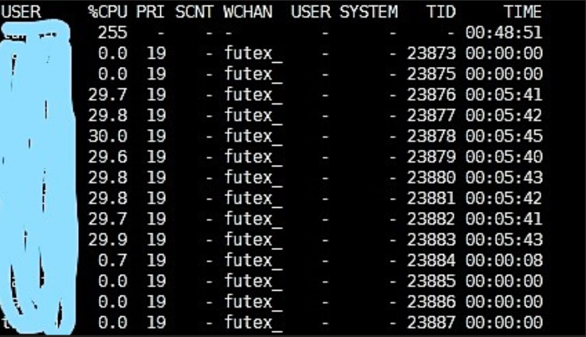

### 现状
线上一个java进程占用了大量的CPU, %CPU 达到了 552.8        

PID | USER | PR | NI | VIRT | RES | SHR | S | %CPU | %MEM | TIME+ | COMMAND
---|---|---|---|---|---|---|---|---|---|---|---|
23873 | tanxing | 20 | 0 | 6572052 | 1.380g | 5348 | S | 552.8 | 4.4  | 35:51.86 | java

### 分析
#### 锁定问题线程
使用 ps -mp pid -o THREAD,tid,time 查看该进程的线程情况，发现该进程的多个线程占用率很高

```
# ps -mp 23873 -o THREAD,tid,time
```


#### 查看线程堆栈
挑选 TID 为 23878的线程查看
printf "%x\n" 23878 (将线程号转变为16进制, 后面用pstack查看需要16进制)

```
# printf "%x\n" 23878 ---> 5d46

```
使用 jstack查看线程堆栈信息，发现是java GC线程

```
# jstack 23873 |grep 5d46 -A 30
```

"GC task thread#0 (ParallelGC)" os_prio=0 tid=0x00007f4ab001d800 nid=0x5d46 runnable

"GC task thread#1 (ParallelGC)" os_prio=0 tid=0x00007f4ab001f800 nid=0x5d47 runnable

"GC task thread#2 (ParallelGC)" os_prio=0 tid=0x00007f4ab0021800 nid=0x5d48 runnable

"GC task thread#3 (ParallelGC)" os_prio=0 tid=0x00007f4ab0023000 nid=0x5d49 runnable

"GC task thread#4 (ParallelGC)" os_prio=0 tid=0x00007f4ab0025000 nid=0x5d4a runnable

"GC task thread#5 (ParallelGC)" os_prio=0 tid=0x00007f4ab0027000 nid=0x5d4b runnable

"GC task thread#6 (ParallelGC)" os_prio=0 tid=0x00007f4ab0028800 nid=0x5d4c runnable

"GC task thread#7 (ParallelGC)" os_prio=0 tid=0x00007f4ab002a800 nid=0x5d4d runnable

从输出信息可见，GC线程运行频繁导致CPU占用过高

#### 内存问题定位
```
# jstat -gcutil 23873 2000 10

 S0     S1     E      O      M     CCS    YGC     YGCT    FGC    FGCT     GCT   
  0.00   0.00 100.00  92.99  98.84  97.81     20    2.748   121  199.764  202.512
  0.00   0.00 100.00  92.85  98.84  97.81     20    2.748   122  201.284  204.033
  0.00   0.00 100.00  93.02  98.85  97.81     20    2.748   123  202.782  205.530
  0.00   0.00 100.00  92.86  98.86  97.81     20    2.748   124  204.293  207.042
  0.00   0.00  35.36  92.85  98.89  97.81     20    2.748   124  205.871  208.619
  0.00   0.00  12.11  93.00  98.94  97.81     20    2.748   125  207.390  210.139
  0.00   0.00   2.05  92.99  98.98  97.81     20    2.748   126  208.909  211.657
  0.00   0.00 100.00  92.99  98.98  97.81     20    2.748   127  208.909  211.657
  0.00   0.00  43.77  92.85  98.99  97.82     20    2.748   127  210.397  213.145
  0.00   0.00 100.00  92.85  98.99  97.82     20    2.748   128  210.397  213.145

```
从输出信息可见,Eden区内存占用长期在100%, Old区内存占用 98.8%, Full GC 的次数在125次左右, Full GC的持续时间也特别长, 平均每次Full GC耗时1.68秒（210.2 / 125）, 因此, 需要优化程序内存占用或者增大分配给java的内存


