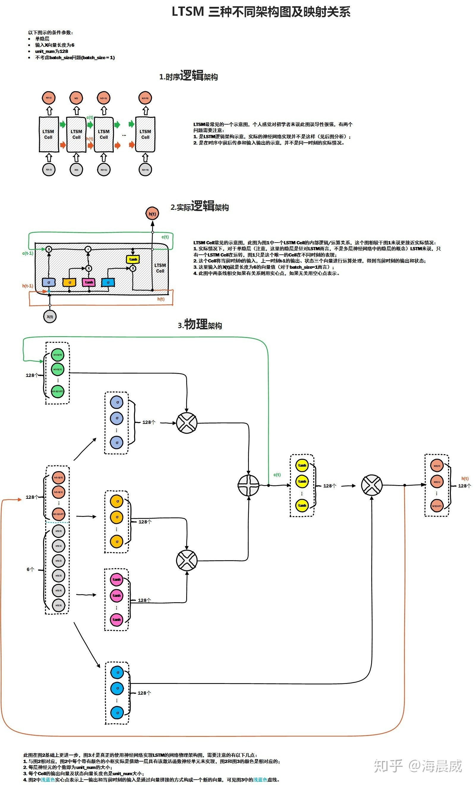

## RNN 和 LSTM
### lstm结构图

### lstm解决梯度消失/梯度爆炸
作者：Towser
链接：https://www.zhihu.com/question/34878706/answer/665429718  
来源：知乎  
著作权归作者所有。商业转载请联系作者获得授权，非商业转载请注明出处。

**LSTM 能解决梯度消失/梯度爆炸”是对 LSTM 的经典误解**。这里我先给出几个粗线条的结论，详细的回答以后有时间了再扩展：  
1. 首先需要明确的是，RNN 中的梯度消失/梯度爆炸和普通的 MLP 或者深层 CNN 中梯度消失/梯度爆炸的含义不一样。MLP/CNN 中不同的层有不同的参数，各是各的梯度；**而RNN中同样的权重在各个时间步共享，最终的梯度 g = 各个时间步的梯度 g_t 的和**。  
2. 由 1 中所述的原因，RNN 中总的梯度是不会消失的。即便梯度越传越弱，那也只是远距离的梯度消失，由于近距离的梯度不会消失，所有梯度之和便不会消失。**RNN 所谓梯度消失的真正含义是，梯度被近距离梯度主导，导致模型难以学到远距离的依赖关系**。  
3. LSTM 中梯度的传播有很多条路径， 这条路径上只有逐元素相乘和相加的操作，梯度流最稳定；但是其他路径（例如）上梯度流与普通 RNN 类似，照样会发生相同的权重矩阵反复连乘。  
4. LSTM 刚提出时没有遗忘门，或者说相当于，这时候在直接相连的短路路径上， 可以无损地传递给，从而这条路径上的梯度畅通无阻，不会消失。类似于ResNet 中的残差连接。  
5. 但是在其他路径上，LSTM的梯度流和普通RNN没有太大区别，依然会爆炸或者消失。由于总的远距离梯度 = 各条路径的远距离梯度之和，即便其他远距离路径梯度消失了，只要保证有一条远距离路径（就是上面说的那条高速公路）梯度不消失，总的远距离梯度就不会消失（正常梯度 + 消失梯度 = 正常梯度）。因此LSTM通过改善一条路径上的梯度问题拯救了总体的远距离梯度。  
6. 同样，因为总的远距离梯度 = 各条路径的远距离梯度之和，高速公路上梯度流比较稳定，但其他路径上梯度有可能爆炸，此时总的远距离梯度 = 正常梯度 + 爆炸梯度 = 爆炸梯度，因此 LSTM 仍然有可能发生梯度爆炸。不过，由于 LSTM 的其他路径非常崎岖，和普通 RNN 相比多经过了很多次激活函数（导数都小于 1），因此 LSTM 发生梯度爆炸的频率要低得多。实践中梯度爆炸一般通过梯度裁剪来解决。  
7. 对于现在常用的带遗忘门的 LSTM 来说，6 中的分析依然成立，而 5 分为两种情况：其一是遗忘门接近 1（例如模型初始化时会把 forget bias 设置成较大的正数，让遗忘门饱和），这时候远距离梯度不消失；其二是遗忘门接近 0，但这时模型是故意阻断梯度流的，这不是 bug 而是 feature（例如情感分析任务中有一条样本 “A，但是 B”，模型读到“但是”后选择把遗忘门设置成 0，遗忘掉内容 A，这是合理的）。当然，常常也存在 f 介于 [0, 1] 之间的情况，在这种情况下只能说 LSTM 改善（而非解决）了梯度消失的状况。  
8. **最后，别总是抓着梯度不放。梯度只是从反向的、优化的角度来看的，多从正面的、建模的角度想想 LSTM 有效性的原因。选择性、信息不变性都是很好的视角**，比如看看这篇：https://r2rt.com/written-memories-understanding-deriving-and-extending-the-lstm.html

### RNN为何使用tanh而不是Relu作为激活函数

