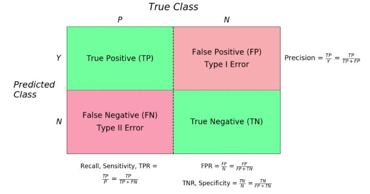
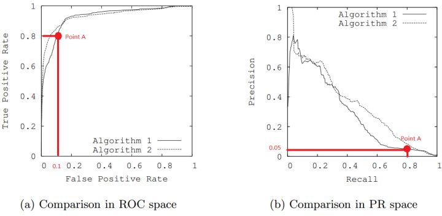
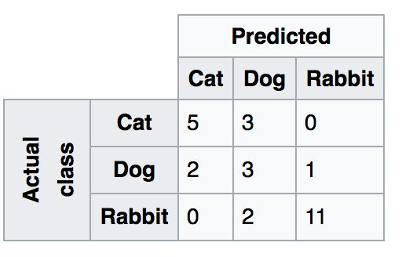
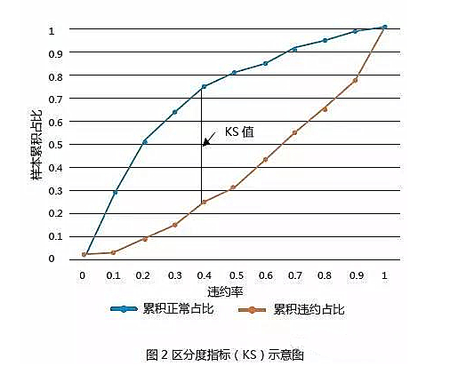
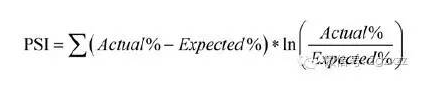

### 分类性能评估
F1 Score：  F1值是为了综合考量精确率和召回率而设计的一个指标，一般公式为取P和R的 harmonic mean:2*Precision*Recall/(Precision+Recall)

ROC-AUC：ROC曲线围成的面积 (即AUC)可以解读为，从所有正例中随机选取一个样本A，再从所有负例中随机选取一个样本B，分类器将A判为正例的概率比将B判为正例的概率大的可能性。可以看到位于随机线上方的点(如图中的A点)被认为好于随机猜测。在这样的点上TPR总大于FPR，意为正例被判为正例的概率大于负例被判为正例的概率。

1. 兼顾正例和负例的权衡。因为TPR聚焦于正例，FPR聚焦于与负例，使其成为一个比较均衡的评估方法。
2. TPR和FPR不依赖于数据的分布
3. TPR用到的TP和FN同属P列，FPR用到的FP和TN同属N列，所以即使P或N的整体数量发生了改变，也不会影响到另一列。也就是说，即使正例与负例的比例发生了很大变化，ROC曲线也不会产生大的变化

缺点：
1. 上文提到ROC曲线的优点是不会随着类别分布的改变而改变，但这在某种程度上也是其缺点。因为负例N增加了很多，而曲线却没变，这等于产生了大量FP。像信息检索中如果主要关心正例的预测准确性的话，这就不可接受了。
2. 在类别不平衡的背景下，负例的数目众多致使FPR的增长不明显，导致ROC曲线呈现一个过分乐观的效果估计。当负例N的数量远超正例P时，FP的大幅增长只能换来FPR的微小改变。结果是虽然大量负例被错判成正例，在ROC曲线上却无法直观地看出来。（当然也可以只分析ROC曲线左边一小段）

F1 Score和AUC对比:

单从图a看，这两个分类器都接近完美(非常接近左上角)。图b对应着相同分类器的PR space。而从图b可以看出，这两个分类器仍有巨大的提升空间。那么原因是什么呢？ 通过看Algorithm1的点 A，可以得出一些结论。首先图a和b中的点A是相同的点，只是在不同的空间里。因为TPR=Recall=TP/(TP+FN)，换言之，真阳性率(TPR)和召回率(Recall)是同一个东西，只是有不同的名字。所以图a中TPR为0.8的点对应着图b中Recall为0.8的点。

假设数据集有100个positive instances。由图a中的点A，可以得到以下结论：TPR=TP/(TP+FN)=TP/actual positives=TP/100=0.8，所以TP=80由图b中的点A，可得：Precision=TP/(TP+FP)=80/(80+FP)=0.05，所以FP=1520再由图a中点A，可得：FPR=FP/(FP+TN)=FP/actual negatives=1520/actual negatives=0.1，所以actual negatives是15200。

由此，可以得出原数据集中只有100个positive instances，却有15200个negative instances！这就是极不均匀的数据集。直观地说，在点A处，分类器将1600 (1520+80)个instance分为positive，而其中实际上只有80个是真正的positive。 我们凭直觉来看，其实这个分类器并不好。但由于真正negative instances的数量远远大约positive，ROC的结果却“看上去很美”。所以在这种情况下，PRC更能体现本质。

结论： 在negative instances的数量远远大于positive instances的data set里， PRC更能有效衡量分类器的好坏。

二分类问题:   
指标的好坏主要取决于分类器的目标。比方说，电子邮件的垃圾过滤，你是希望它更全面（查出所有的垃圾，但是会有大量有用信息也被判为垃圾）呢，还是希望它尽量精准（不要老是将有用的邮件判为垃圾）呢？在这个例子里，显然，我们认为False Positive的伤害要大于False Negative：重要邮件要是被判成垃圾所造成的损失，远大于收件箱里还有一部分的垃圾邮件。在这种情况下，我们会认为Precision的指标会比较重要，或者反应在ROC图上，FPR尽量的小——自然，在保证FPR的基础上，Recall依然还是重要的——毕竟用户购买的是垃圾过滤，如果只是过滤了1条垃圾但是Precision＝100%，这样的东西看起来也没什么用——那么综合起来，我们也可以通过ROC的AUC来进行比较，面积较大的代表同样的FPR下面，recall比较高。  
但是，ROC的曲线——如上面几位已经说过——有数据均衡的问题。在数据极度不平衡的情况下，譬如说1万封邮件中只有1封垃圾邮件，那么如果我挑出10封，50封，100，。。封垃圾邮件（假设全部包含真正的那封垃圾邮件），Recall都是100%，但是FPR分别是9/9999, 49/9999, 99/9999（数据都比较好看：FPR越低越好），而Precision却只有1/10，1/50， 1/100 （数据很差：Precision越高越好）。  
所以在数据非常不均衡的情况下，看ROC的AUC可能是看不出太多好坏的，而PR curve就要敏感的多。（不过真实世界中，垃圾邮件也许与你的有用的邮件一样多——甚至比有用的还更多）    
其次是搜索问题。搜索问题其实是一个排序问题，但我们往往会定义Precision@Top K这样的指标，即正确的答案有没有被排在Top K中，如果是的话，就相当于判断为“真”，反之则为“否”。这样搜索问题就转化为了一个二分类问题，唯一的问题是，这是一个典型的数据不均衡的case。很显然，所有的候选集的数量是非常巨大的，但是K的数量不会很大（比如Top 10, Top 20）。所以，在这个问题中，我们会主要看Precision-Recall curve。更重要的是，一般而言，人们看搜索结果都不会太有耐心，所以希望Top K中的有用信息尽量多，换言之，Precision@Top K的指标，是最核心的。我们再考虑一个任务，机器阅读理解（Machine Reading Comprehension, MRC），机器阅读一篇文章以后人类向它提问，由机器回答。这时候，所谓的Precision，是指机器回答的答案中，正确的比例。但是在这个任务中，Recall同样重要：机器也有可能回答不出来问题，但是“回答不出”，其实和“回答错误”是没有差别的。在这样的任务中，我们希望能够公平的Balance Precision和Recall的一个数字，所以我们认为F1 Score是一个好的衡量指标。然而如果我们的问题是多分类的问题，实际上这些指标就不适合了。

多分类问题:  
多分类的问题，需要看的是Confusion Matri:

在上图中，对于某一类别（比如猫）而言，错误会分为被误判成狗或误判成兔子两种情形，共记9种不同的类别，其中三类（对角线上的元素）是分类正确的。显然，仅仅用TP/TN/FP/FN这四类已经不足以分析这样的问题了。

### 风控模型评估
#### KS
区分度指标（KS）是度量具体模型下**正常样本和违约样本分布的最大差距**，首先按照样本的信用分数或预测违约率从小到大进行排序，然后计算每一个分数或违约率下好坏样本的累计占比。**正常和违约样本的累计占比差值的最大值即为区分度指标（KS）**。区分度指标（KS）的示意如图2所示。区分度指标（KS）小于0.2代表模型准确性差，超过0.75则代表模型准确性高

#### PSI
群体稳定指数（Population Stability Index，PSI）是最常用的模型稳定性评价指标。群体稳定指数（PSI）的计算公式为：

其中预期占比（Expected%）和实际占比（Actual%)分别表示在模型训练样本和测试样本中，对应分数段或违约率段内的人群占比。一般而言，群体稳定指数（PSI）小于0.1代表模型稳定性高，群体稳定指数（PSI）大于0.1小于0.25代表模型稳定性中等，群体稳定指数（PSI）大于0.25代表模型稳定性较差。
