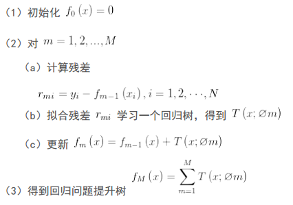
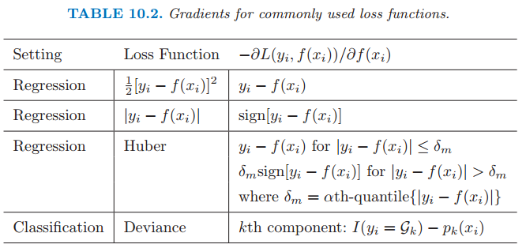
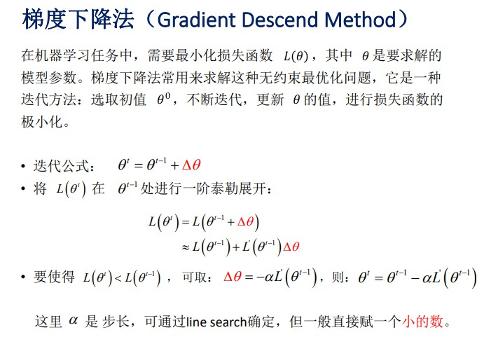
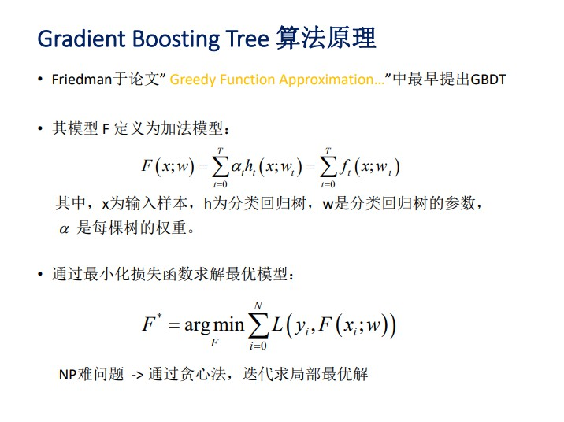
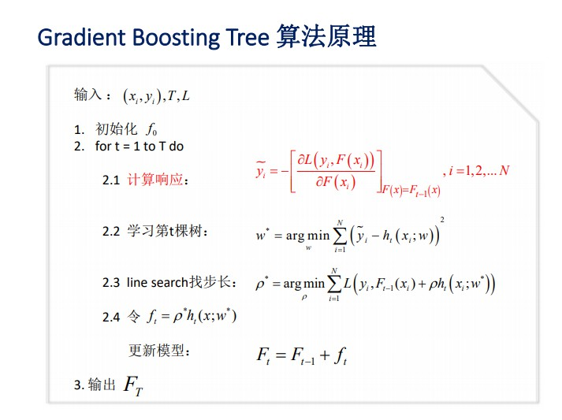

## 常用的算法
### SVM和LR的对比
相同点：
1. SVM和LR一般用来处理线性二分类问题，特殊处理之后可以处理多分类问题
2. 两者在使用核函数后，可以处理非线性问题
3. 两者都是判别模型

不同点：
1. LR是参数模型，它假设数据集满足伯努利分布，SVM是非参数模型，它对数据集的分布没有假设。
2. LR使用log loss，SVM使用hinge loss，这两个损失函数的目的都是增加对分类影响较大的数据点的权重，减少与分类关系较小的数据点的权重。SVM只与部分样本(支持向量)有关，LR与所有样本有关
3. LR是经验风险最小化，SVM是结构风险最小化
4. 两个模型对数据和参数的敏感程度不同，Linear SVM比较依赖penalty的系数和数据表达空间的测度，而（带正则项的）LR比较依赖对参数做L1 regularization的系数。但是由于他们或多或少都是线性分类器，所以实际上对低维度数据overfitting的能力都比较有限，相比之下对高维度数据，LR的表现会更加稳定，为什么呢？因为Linear SVM在计算margin有多“宽”的时候是依赖数据表达上的距离测度的，换句话说如果这个测度不好（badly scaled，这种情况在高维数据尤为显著），所求得的所谓Large margin就没有意义了，这个问题即使换用kernel trick（比如用Gaussian kernel）也无法完全避免。所以使用Linear SVM之前一般都需要先对数据做normalization，而求解LR（without regularization）时则不需要或者结果不敏感。
5. LR可以给出类别的概率，SVM是非概率的

总结一下：
1. Linear SVM和LR都是线性分类器
2. Linear SVM不直接依赖数据分布，分类平面不受一类点影响；LR则受所有数据点的影响，如果数据不同类别strongly unbalance一般需要先对数据做balancing。
3. Linear SVM依赖数据表达的距离测度，所以需要对数据先做normalization；LR不受其影响
4. Linear SVM依赖penalty的系数，实验中需要做validation 
5. Linear SVM和LR的performance都会收到outlier的影响，其敏感程度而言，谁更好很难下明确结论。

模型选择：
1. 如果Feature的数量很大，跟样本数量差不多，这时候选用LR或者是Linear Kernel的SVM
2. 如果Feature的数量比较小，样本数量一般，不算大也不算小，选用SVM+Gaussian Kernel
3. 如果Feature的数量比较小，而样本数量很多，需要手工添加一些feature变成第一种情况

### 树模型
ID3，C4.5, CART
1. ID3以信息增益为准则来选择最优划分属性(信息增益的计算要基于信息熵，计算分割后与分割前的信息熵的差值，也就是信息增益)；**缺陷：** ID3决策树偏向于取值较多的属性进行分割，存在一定的偏好
2. C4.5基于信息增益率准则选择最优分割属性， 信息增益比率通过引入一个被称作分裂信息(Split information)的项来惩罚取值较多的属性，如果简单的按照这个规则来分割，模型又会偏向特征数少的特征。**因此C4.5决策树先从候选划分属性中找出信息增益高于平均水平的属性，在从中选择增益率最高的。**
3. CART以基尼系数为准则选择最优划分属性，可以应用于分类和回归，CART是一棵二叉树，采用二元切分法，CART分类时，使用基尼指数（Gini）来选择最好的数据分割的特征，gini描述的是纯度，与信息熵的含义相似。

### 随机森林
1. 随机森林是一个典型的多个决策树的组合分类器。主要包括两个方面：数据的随机性选取，以及待选特征的随机选取。
2. 数据随机性选取：a. 从原始的数据集中采取**有放回的抽样(bootstrap)**，构造子数据集，子数据集的数据量是和原始数据集相同的; b. 利用子数据集来构建子决策树，将这个数据放到每个子决策树中，每个子决策树输出一个结果
3. 特征随机选取：随机森林中的子树的每一个分裂过程并未用到所有的待选特征，而是从所有的待选特征中随机选取一定的特征，之后再在随机选取的特征中选取最优的特征。这样能够使得随机森林中的决策树都能够彼此不同，提升系统的多样性，从而提升分类性能

### BDT和GBDT
BDT是提升树，通过拟合残差的方式来构建新的树 

  
**注意(a)步骤，直接利用真实值与当前预测值相减来计算残差，然后来拟合残差学习一颗新的树T** 

对于损失函数是平方损失的情况，可以这样操作，但是对于其它形式的损失函数，这样直接相减得到残差就不行了，例如下面更复杂的Huber损失
   

针对这个问题，**Freidman提出了梯度提升算法：利用最速下降的近似方法，即利用损失函数的负梯度在当前模型的值，作为回归问题中提升树算法的残差的近似值**，拟合一个回归树。（注：鄙人私以为，与其说负梯度作为残差的近似值，不如说残差是负梯度的一种特例），因此就有了GBDT

GBDT是在**函数空间**中利用梯度下降法进行优化，与此相比，其他算法比如LR是在**参数空间**进行梯度下降：
- LR的每一步迭代是利用参数的梯度更新参数，从而达到loss最小值。

- GBDT拟合残差的方式是利用损失函数的梯度，如下图2.1中计算的那样，对损失函数求梯度值

在2.1求得了残差的近似值之后，利用它来学习一颗新的树ht，我们期望它们之间的损失最小化(2.2用的是平方损失)，因此可以求出最小化情况下的w.  2.3利用线搜索估计叶节点区域的值, 使损失函数极小化, 得到最优的步长(也可以在初始化时设置)，最后更新模型，将新的树加入到已有的模型中

### 问题
1. 提主刚接触机器学习，参加kaggle的时候，用xgboost/gbdt在在调参的时候把树的最大深度调成6就有很高的精度了。但是用DecisionTree/RandomForest的时候需要把树的深度调到15或更高，为什么？
- Boosting主要关注降低偏差，因此Boosting能基于泛化性能相当弱的学习器构建出很强的集成；Bagging主要关注降低方差，因此它在不剪枝的决策树、神经网络等学习器上效用更为明显。随机森林(random forest)和GBDT都是属于集成学习（ensemble learning)的范畴。
- 集成学习下有两个重要的策略Bagging和Boosting。Bagging算法是这样做的：每个分类器都随机从原样本中做有放回的采样，然后分别在这些采样后的样本上训练分类器，然后再把这些分类器组合起来。简单的多数投票一般就可以。其代表算法是随机森林。Boosting的意思是这样，他通过迭代地训练一系列的分类器，每个分类器采用的样本分布都和上一轮的学习结果有关。其代表算法是AdaBoost, GBDT。其实就机器学习算法来说，其泛化误差可以分解为两部分，偏差（bias)和方差(variance)。这个可由下图的式子导出（这里用到了概率论公式D(X)=E(X^2)-[E(X)]^2）。偏差指的是算法的期望预测与真实预测之间的偏差程度，反应了模型本身的拟合能力；方差度量了同等大小的训练集的变动导致学习性能的变化，刻画了数据扰动所导致的影响
- 对于Bagging算法来说，由于我们会并行地训练很多不同的分类器的目的就是降低这个方差(variance) ,因为采用了相互独立的基分类器多了以后，h的值自然就会靠近.所以对于每个基分类器来说，目标就是如何降低这个偏差（bias),所以我们会采用深度很深甚至不剪枝的决策树。对于Boosting来说，每一步我们都会在上一轮的基础上更加拟合原数据，所以可以保证偏差（bias）,所以对于每个基分类器来说，问题就在于如何选择variance更小的分类器，即更简单的分类器，所以我们选择了深度很浅的决策树。
